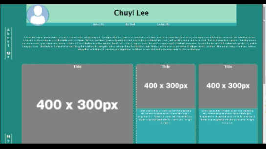

# <Your-Project-Title>

## Description

As a budding fullstack developer, I needed a start on a personal portfolio. This was my first use in applying various things I've learned (a lot of new CSS, such as media queries and display properties), along with requiring me to learn various other things to get it to work how I wanted to (like the z-index which wasn't taught in class). 

## Credits

With great help from Trinh Nguyen from the tutoring team, Trey Eckles as my instructor, and the YouTube channels 'Fireship' and 'Slaying The Dragon'.

## License

None (for the moment?)

## Screenshot

## Deployed Application
https://achurale.github.io/my-portfolio/